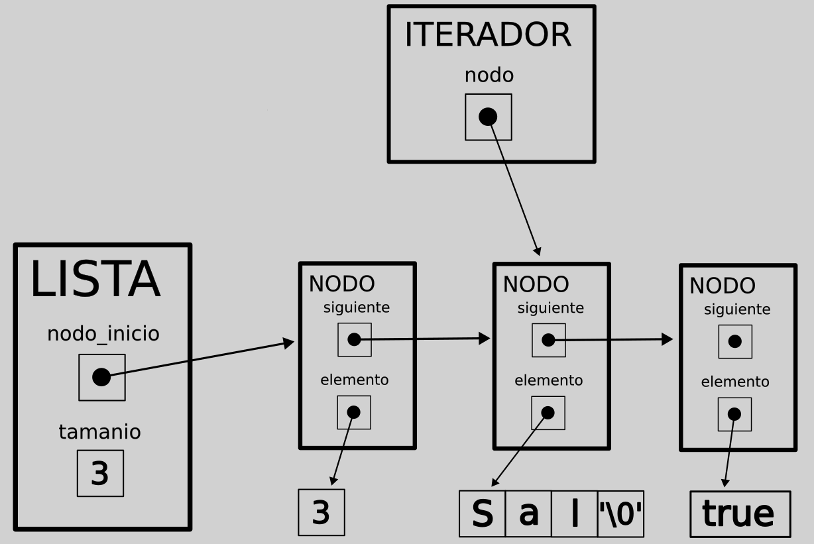
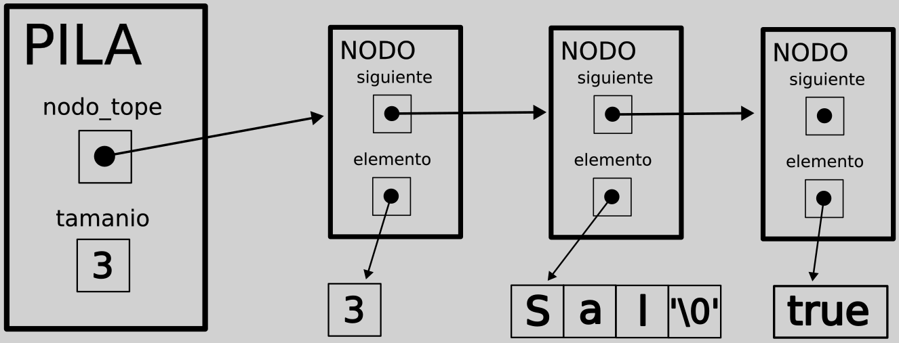
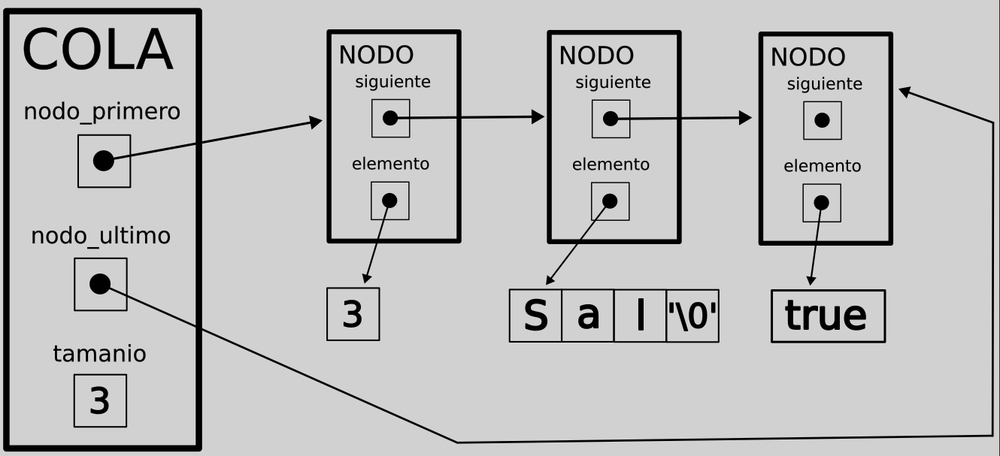
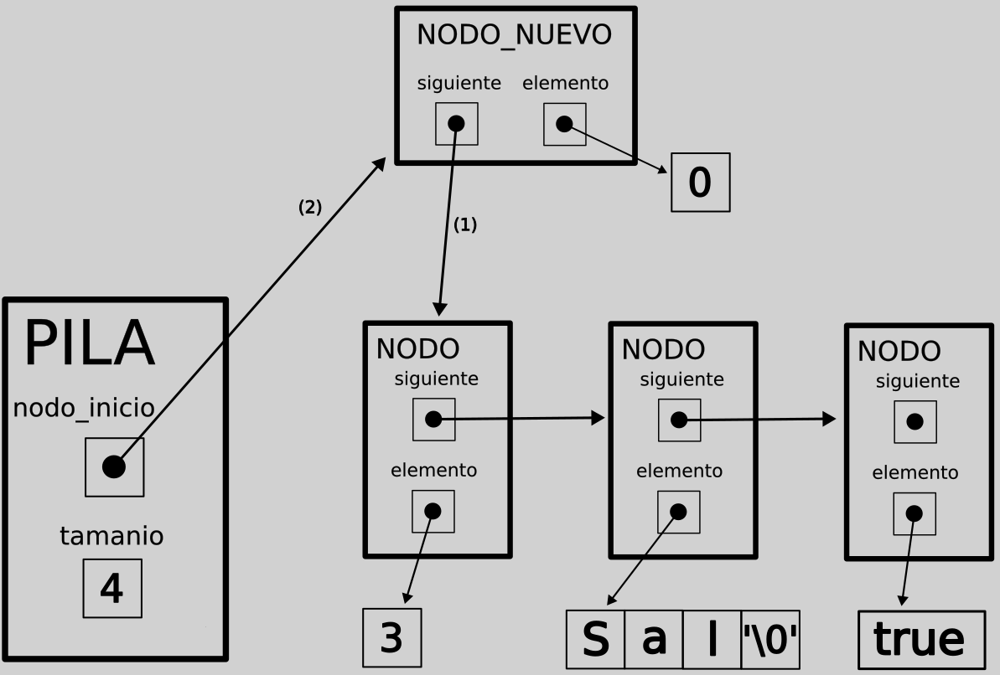
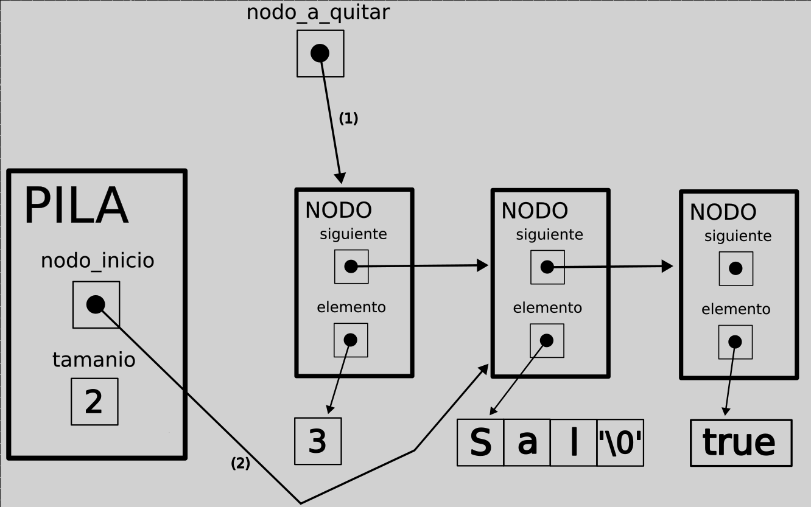
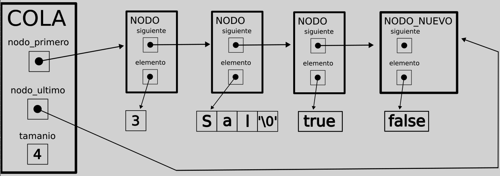
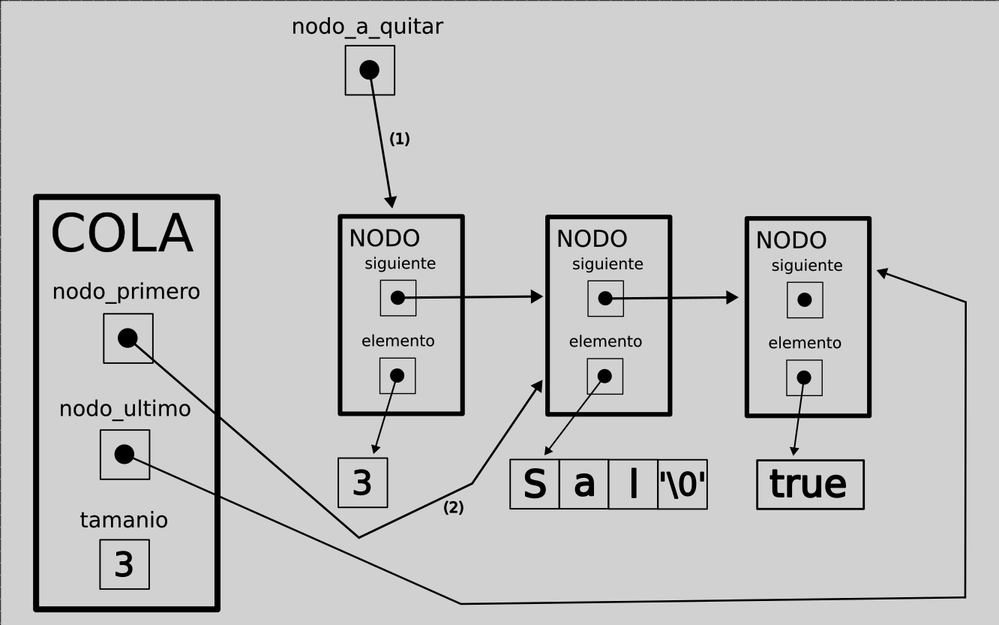

<div align="right">
</div>

## TDAS LISTA, PILA Y COLA

- Para compilar:

```bash
gcc src/*.c pruebas.c -o pruebas
```

- Para ejecutar:

```bash
./pruebas
```

- Para ejecutar con valgrind:
```bash
valgrind ./pruebas
```
---
##  Funcionamiento

### Lista enlazada:

En una lista enlazada, se tiene una referencia al primer nodo, y el tamaño de la lista. 
```c
struct lista {
	nodo_t *nodo_inicio;
	size_t tamanio;
};
```
Cada nodo tiene una referencia al nodo siguiente, y un puntero al elemento que almacena. De esta manera, se van sumando nodos que están conectados y contienen elementos, y se va formando la lista. 
```c
typedef struct nodo {
	void *elemento;
	struct nodo *siguiente;
} nodo_t;
```
De esta manera se pueden implementar muchas funciones para modificar la lista.
Para **insertar al final** de la lista, se itera hasta el final de la misma, hasta que el siguiente del nodo actual es NULL (el último nodo), y luego se apunta el siguiente al nuevo puntero, que se convierte en el último de la lista. 
```c
if (!lista->nodo_inicio) {
	lista->nodo_inicio = nodo_nuevo;
} else {
	nodo_t *nodo_actual = lista->nodo_inicio;
	while (nodo_actual->siguiente)
		nodo_actual = nodo_actual->siguiente;
	nodo_actual->siguiente = nodo_nuevo;
}
```
En cambio, si se quiere **insertar en cierta posición**, se utiliza un iterador hasta llegar a la posición que se busca, y ahi se apunta el nuevo nodo al siguiente del nodo actual, y luego el actual se apunta al nuevo nodo, utilizando este orden para no perder la referencia al nodo siguiente del nuevo nodo.
```c
if (posicion == 0) {
		nodo_nuevo->siguiente = lista->nodo_inicio;
		lista->nodo_inicio = nodo_nuevo;
	} else {
		nodo_t *nodo_actual = lista->nodo_inicio;
		for (int i = 0; i < posicion - 1; i++)
			nodo_actual = nodo_actual->siguiente;
		nodo_nuevo->siguiente = nodo_actual->siguiente;
		nodo_actual->siguiente = nodo_nuevo;	
	}
```
Para **quitar del final** de la lista, se itera hasta el anteultimo nodo, se crea un puntero a nodo que apunta al último nodo (nodo_actual->siguiente), se apunta el nodo_actual a NULL, se crea un void pointer elemento que apunta al elemento del nodo a quitar, se libera este nodo, y se devuelve el elemento. Es importante tener un nodo auxiliar que apunta al que se tiene que eliminar, porque si no se pierde la referencia a este nodo al apuntar el anteultimo a NULL, y se pierde memoria. Obviamente si solo se tiene un nodo, se devuelve el elemento de ese nodo, se libera y se apunta el nodo_inicio de la lista a NULL.
```c
if (lista->tamanio == 1) {
		elemento = lista->nodo_inicio->elemento;
		free(lista->nodo_inicio);
		lista->nodo_inicio = NULL;
	} else {
		nodo_t *nodo_actual = lista->nodo_inicio;
		while (nodo_actual->siguiente->siguiente)
			nodo_actual = nodo_actual->siguiente;
		nodo_t *nodo_quitar = nodo_actual->siguiente;
		elemento = nodo_quitar->elemento;
		nodo_actual->siguiente = NULL;
		free(nodo_quitar);
	}
```
Para **quitar de cierta posición** se itera hasta el nodo anterior de esa posición, se utiliza nuevamente un auxiliar que apunta al nodo a quitar, se apunta el nodo actual al siguiente del nodo a quitar, y se libera el nodo a quitar (y se devuelve el elemento del nodo a quitar). 
```c
if (posicion == 0) {
		nodo_a_quitar = lista->nodo_inicio;
		elemento = nodo_a_quitar->elemento;
		lista->nodo_inicio = nodo_a_quitar->siguiente;
	} else {
		nodo_t *nodo_actual = lista->nodo_inicio;
		for (int i = 0; i < posicion - 1; i++)
			nodo_actual = nodo_actual->siguiente;
		nodo_a_quitar = nodo_actual->siguiente;
		elemento = nodo_a_quitar->elemento;
		nodo_actual->siguiente = nodo_a_quitar->siguiente;
	}
```
También se puede utilizar un **iterador externo** para la lista, que tiene un puntero al nodo actual, y puede avanzar sobre la lista, devolver si tiene un siguiente, y devolver el elemento actual.
<div align="center">

</div>

### Pila:
La pila tiene la misma estructura que la lista enlazada, pero sigue la ley **LIFO: Last In First Out (último en entrar primero en salir)**. Es decir que los elementos se van, justamente, apilando: solo tenemos una referencia al primer nodo, por lo que solo podemos insertar y sacar del tope.
```c
struct pila {
	nodo_t *nodo_tope;
	size_t tamanio;
};
```
Para todas las funciones de pila se puede reutilizar la implementación de lista enlazada. **Apilar** es lo mismo que insertar en la posición cero, **desapilar** es lo mismo que quitar del principio, y luego se puede **ver el tope** (ver el primer elemento), **ver el tamaño**, ver si **está vacía** (al igual que con la lista enlazada, viendo si el tamaño es cero), y **destruirla**.
<div align="center">

</div>

### Cola:
La cola, al contrario que la pila, sigue la ley **FIFO: First In First Out (primero en entrar primero en salir)**. Es decir que los elementos se van justamente encolando, de manera que se puede sacar por el principio, pero se encola (inserta) por el final.

Las implementaciones de las distintas funciones son muy parecidas a las de lista, pero hay que tener en cuenta la referencia al **último nodo**.
Para **encolar**, si la cola está vacía hacemos que las referencias al primer y ultimo nodo apunten al nuevo nodo, y si no, hacemos que la referencia al último nodo apunte al nuevo nodo.

Por otro lado, **desencolar** es lo mismo que quitar de la posición 0, dejando al último nodo igual, a menos que haya un solo elemento en la cola, donde tanto el primer como el último nodo deberían apuntar a NULL. 
También se puede ver el **frente** de la cola (primer nodo), el **tamaño**, si **está vacía**, y **destruir**.
<div align="center">

</div>

## Respuestas a las preguntas teóricas

 - ¿Qué es una lista/pila/cola? Explicar con diagramas.

Esto ya fue explicado arriba, en la explicación del funcionamiento del código.

 - Explica y analiza las diferencias de complejidad entre las implementaciones de lista simplemente enlazada, doblemente enlazada y vector dinámico para las operaciones:
   - Insertar/obtener/eliminar al inicio

    #### Lista simplemente enlazada:
    Las 3 operaciones son **O(1)**, puesto que solo tenemos que interactuar con el primer nodo, para el cual ya tenemos referencia en el puntero de la estructura.

    #### Lista doblemente enlazada:
    Las 3 operaciones también son **O(1)**, porque tenemos la referencia directa al primer nodo.

    #### Vector dinámico:
    Insertar al principio es **O(n)**, ya que debemos correr todos los elementos un lugar hacia la derecha, porque recordemos que en memoria se encuentran todos los datos en bloques adyacentes.

    Obtener del inicio es **O(1)**, ya que en un vector siempre se tiene acceso directo a la posición que sea.

    Eliminar del inicio es **O(n)**, porque debemos mover los elementos restantes hacia la izquierda.

   - Insertar/obtener/eliminar al final

   #### Lista simplemente enlazada:
   Las 3 operaciones son **O(n)**, puesto que debemos recorrer toda la lista hasta el final para hacerlas, dado que solo tenemos una referencia directa al primer nodo de la lista.

   #### Lista doblemente enlazada:
   Las 3 operaciones son **O(n)**, por la misma razón que en la lista simplemente enlazada.

   #### Vector dinámico:
   En promedio insertar al final es O(1), ya que se va amortizando. Si hacemos un realloc (que es O(n)) con muchos bloques de memoria en un momento, las siguientes inserciones van a ser de tiempo constante, porque ya habremos reservado esa memoria, y solo quedaría insertar al final. Es decir que, "hacia el infinito", termina siendo O(1).
   Obtener y eliminar al final también son O(1), porque tenemos acceso directo a todas las posiciones del vector, y al eliminar al final no hay que mover los demás datos en memoria.

   - Insertar/obtener/eliminar al medio

   #### Lista simplemente enlazada:
   Las 3 operaciones son O(n), porque tenemos que recorrer la lista hasta la posición que queremos, puesto que, como ya sabemos, solo se tiene una referencia al primer nodo.

   #### Lista doblemente enlazada:
   Las 3 operaciones son O(n), por la misma razón que en la lista simplemente enlazada.

   ### Vector dinámico:
   Insertar y eliminar en el medio es O(n), porque, aunque tenemos acceso directo a los elementos, para insertar tenemos que mover los elementos que se encuentran a la derecha del insertado hacia la derecha, y en el caso de eliminar, hacia la izquierda. 
   Obtener del medio es O(1), porque tenemos acceso directo a todas las posiciones del vector.

 - Explica la complejidad de las operaciones implementadas en tu trabajo para la pila y la cola.

### Pila:

#### Apilar:

Es O(1), ya que solo se apunta el nuevo nodo al primer nodo de la pila, y luego la referencia al primer nodo de la pila se apunta al nuevo nodo. No hay que recorrer nada, sino que son solo estas dos instrucciones.
```c
nodo_nuevo->siguiente = lista->nodo_inicio;
lista->nodo_inicio = nodo_nuevo;
```
<div align="center">

</div>

#### Desapilar:

Es O(1), solo se tiene que crear un puntero al nuevo nodo, cuyo siguiente se apunta al primer nodo de la pila, y la referencia de la pila al primer nodo se apunta a este nuevo nodo. Es lo mismo que insertar en la primera posición.
```c
nodo_a_quitar = lista->nodo_inicio;
elemento = nodo_a_quitar->elemento;
lista->nodo_inicio = nodo_a_quitar->siguiente;
```
<div align="center">

</div>


### Cola:

#### Encolar:

Es O(1), ya que solo se apunta el último nodo al nuevo nodo, y la referencia de la cola al último nodo también. Obviamente si la cola está vacía en vez de apuntar el siguiente del ultimo nodo al nuevo, se apunta la referencia del primer nodo de la cola al nuevo nodo.
```c
if (!cola->nodo_primero)
	cola->nodo_primero = nodo_nuevo;
else
	cola->nodo_ultimo->siguiente = nodo_nuevo;
cola->nodo_ultimo = nodo_nuevo;
```
<div align="center">

</div>

#### Desencolar:

Es O(1), ya que solo se crea un nodo auxiliar que apunta al primer nodo, se apunta la referencia al primer nodo de la cola al siguiente del nodo auxiliar, y se libera el nodo auxiliar. Si nodo_primero queda apuntando a NULL, el último nodo también se debe apuntar a NULL, porque queda vacía.
```c
nodo_t *nodo_a_quitar = cola->nodo_primero;
void *elemento = nodo_a_quitar->elemento;
cola->nodo_primero = nodo_a_quitar->siguiente;
free(nodo_a_quitar);
if (!cola->nodo_primero)
	cola->nodo_ultimo = NULL;
```
<div align="center">

</div>
